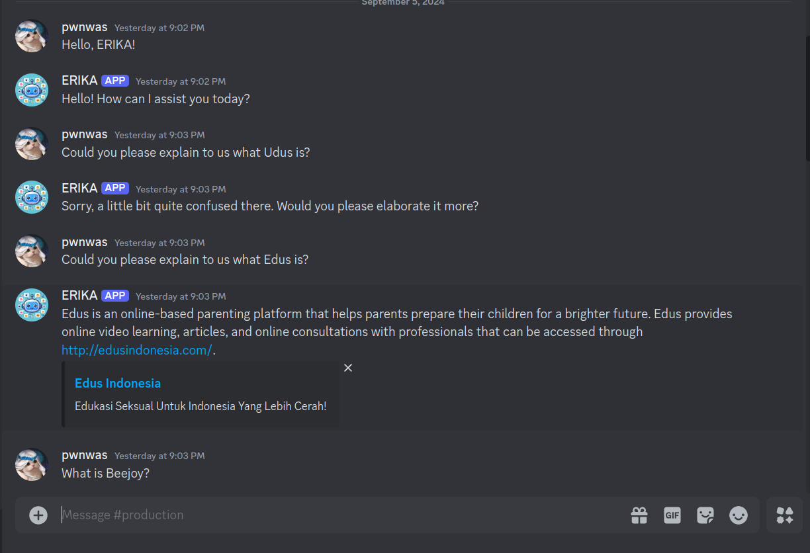

# ERIKA - Chatbot
:robot: ERIKA (**Edus Robust and Intelligent Knowledge Assistant**) is a regex-based chatbot intended to help customers to learn more about Edus, its products, and many more!

## Bot Setup
1. Go to [Discord Developer Portal](https://discord.com/developers/docs/intro)
2. Go to "Application" menu
3. Make a new app
4. Go to "Bot" menu
5. Add bot
6. Generate and copy the bot token
7. Scroll down, check the "Administrator" checkbox
8. Go to "OAuth2" menu
9. Scroll down, check the "bot" and "Administrator" checkbox
10. Copy the link generated
11. Paste the link into a new tab
12. Add the bot into the server
13. Open terminal
14. Run `pip install discord.py`

## Team
:computer: Developed by me and @Sakticahyaa
